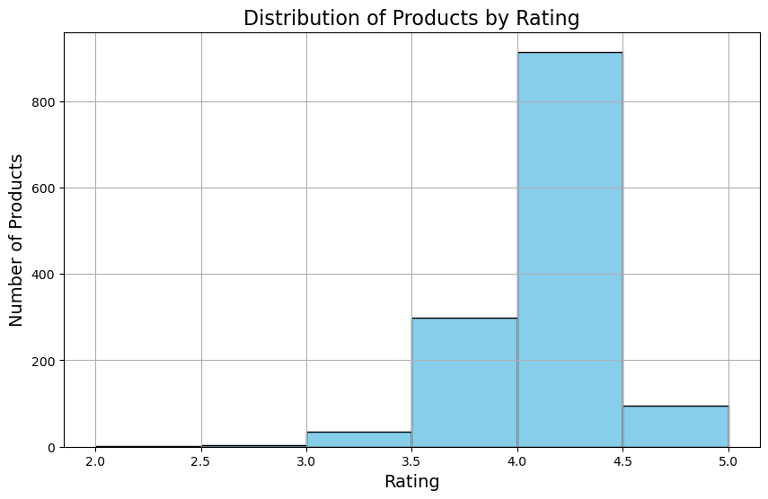

# Fulfillment by Amazon proposal
>Our model will predict the high chances of ratings for various product classes to help fulfillment centers prioritize products in their inventories. 
>* We are correlating high customer ratings with high purchase probability.

## Approach 
* **DATASET:**
  > Amazon Product's Ratings and Reviews as per their details listed on the official website of Amazon 
  > * **Link:** https://www.kaggle.com/datasets/karkavelrajaj/amazon-sales-dataset 
  > * **file name:** amazon.csv 
  
* **DESCRIPTION:**
  >This dataset has the data of 1K+ Amazon Product Ratings and Reviews as per their details listed on the official website of Amazon

* **ANALYSIS:** 
  >First we have a data walkthrough and groupings
* **Data preprocessing:**
  >* **Setup:** 
  >   * create a `gitconfig.py` file in your repository and set your environment path in the file to `env_path = "repository path\Resources"`
  >* **Data Cleaning:** 
  >* **Data exploration:**
  >   * The dataPreprocessing.ipynb file reads the amazon.csv file. Make sure you are using the correct path in the **setup** steps above
  >  * **Models used:** Models can be viewed in our respective branches (adedapo,randon,shubhda,alfredo) We experimented with sevaral models but settled on `Linear Regression` as it gave us the highest R2 score of 95%
  >   
  >* **Data visualizations:**
  >   * Create informative graphs and charts to 
  >     * product performance
  >     * customer preference
  >     * pricing strategies
  >     * to inform business decisions.

# Summary
>In our data we were able to plot the distribution of customer ratings over our product catalog and discovered over 50% of our products get high ratings and thus prioritizing our inventory to fulfilling those products would yield profitability.
